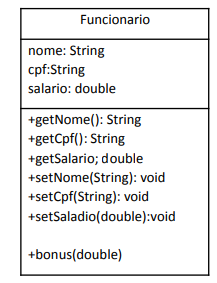

# Java Wipro Bootcamp 2022

## Atividades da Aula 04

### Squad 07
- Jeferson Gomes 
- Jeferson vieira Favero
- Leonardo M Silva
- Ederson M Melo
- Israel Lima Dias

#

1. Crie uma estrutura de herança para demonstrar o polimorfismo utilizando classes de animais.

2. Crie o método comunicar() e movimentar() na classe Animal.

3. Nas classes descendentes de animais, sobrescreva os métodos citados de acordo com os tipos de animais.
#

By Gama Academy
 

